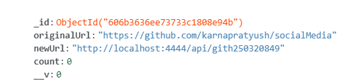

# URL SHORTNER

### I tried to make an url shortner using NodeJs and MongoDb. This project only contains apis to shorten the url. No frontend is used

### project structure
````
├───db
├───model
├───routes
└───urlShort
````

1. Db folder contains connection with mongodb
2. model folder contains how the schema is defined. The cluster contains original-Url, shortend-Url and number of times a shortend-Url is clicked.

3. Routes are used for api to add and fetch shortend link from db
4. In urlShort I kept the logic of shortening of big urls.  It takes at max 4 character from url and add a random interger at its end.
5. The convert.js file also take care of duplicate link shortner.